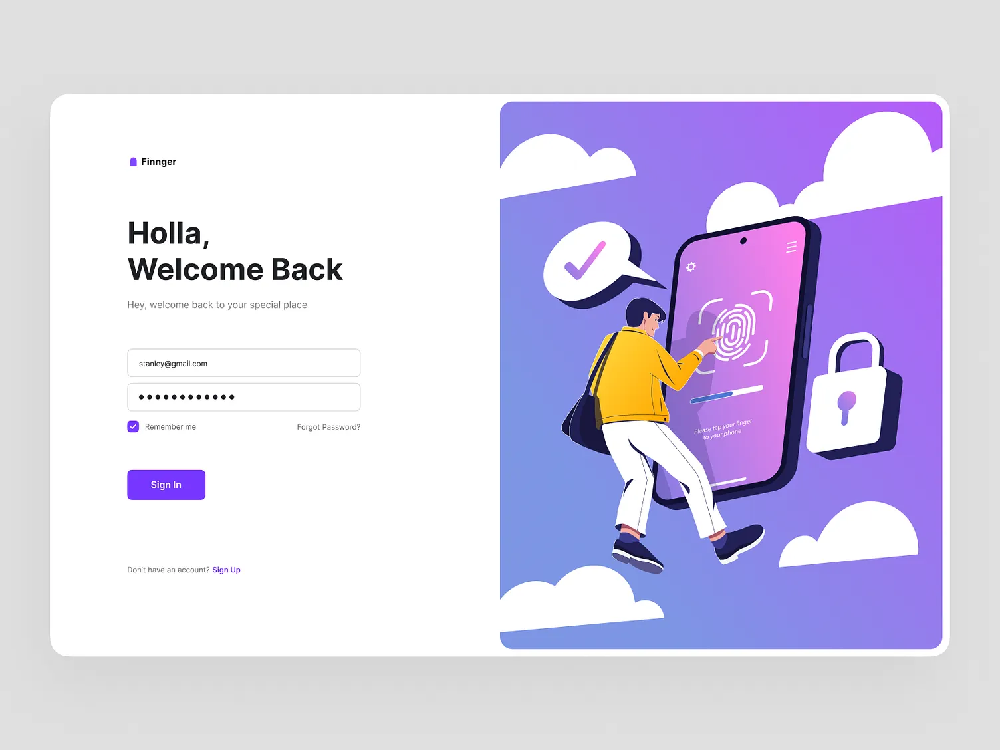
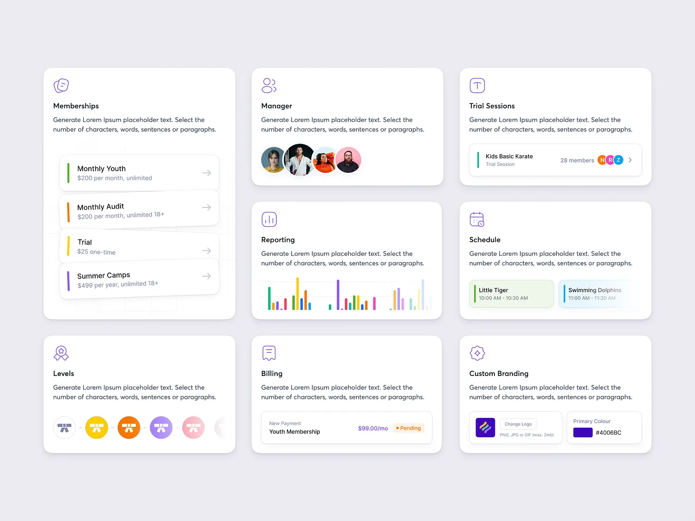

# My Understanding of my Given OrgByte Task
I was tasked with creating a reusable verification component that changes it's outook(color and content) based on a user's verfication status 

## This means
- A Verified User (Name, Green Verified Status, Categories, Date)
- A Pending User (Yellow Pending Status, Message)
- A Pending User (Gray Unverified Status, Message)

## Conclusion
Their state should render based on the users verified status

## Here's my design reference

## Link
 - https://cdn.dribbble.com/userupload/14898989/file/original-71db7cb2b174ad93235ff7585ad9ea3a.png?resize=752x&vertical=center
 - https://dribbble.com/shots/22434425-Bento-Cards
 - https://i.pinimg.com/1200x/7f/72/6e/7f726e1863a5ffaa490cb7b82ee6ac96.jpg