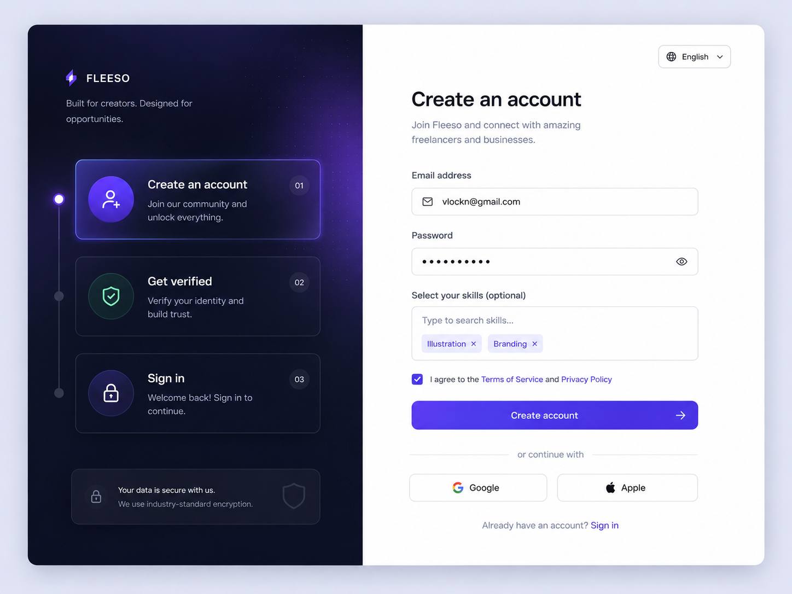

# Verification Component Task

A reusable verification component built to dynamically display different user verification states (verified, pending, and unverified) while maintaining a consistent UI structure.

# Overview

This project was created as part of a frontend verification task.
The goal was to build a reusable UI component capable of displaying different verification states based on incoming user data.

Instead of creating separate components for every user state, I decided to create a single reusable component that changes its appearance and content depending on the user's verification status.

This approach improves:

- Reusability
- Scalability
- Maintainability
- Consistency across the application

# Problem Statement

To show whether a user is verified, awaiting approval, or completely unverified.

Without a reusable structure:

- UI duplication increases
- Styling becomes inconsistent
- Logic becomes harder to maintain

This project solves that problem by through the verification logic in one reusable component.

# My Thought Process

Before writing the UI, I first identified the possible states a user could have:

- Verified
- Pending
- Unverified

From there, I asked myself:

> “What information changes between these states?”

I noticed:

- Colors change
- Labels change
- Additional information changes
- Some sections appear conditionally

So instead of creating multiple pages/components, I built one flexible component that:

- Receives a status
- Dynamically renders the correct content
- Applies conditional styling
- Shows additional information only when necessary

This made the component easier to scale if more statuses are added later.

---

#

l

---

# Design Trade-offs

While building this component, I made several design decisions based on simplicity and reusability.

## 1. Single Reusable Component vs Multiple Separate Components

One major decision was choosing to build a single reusable verification component instead of creating separate components for each verification state .

### Why I chose this approach

- Reduced code duplication
- Made styling easier to maintain
- Improved scalability for future states

### Trade-off

This approach introduced more conditional rendering logic inside the component, which slightly increased complexity compared to fully separate components.

---

## 2. Minimal Animations vs Performance Simplicity

I considered adding animations and transitions between verification states to create a more interactive experience.

### Why I chose not to

I decided to prioritize:

- Faster rendering
- Simpler implementation
- Cleaner state transitions

---

## 3. Static Data vs Full Backend Integration

For this task, I initially used static/mock data but eventually implemented a full backend and database system(JSON file acting in place of the database).

## 4. Conditional Rendering vs Separate Layout Files

I chose conditional rendering within the component instead of maintaining entirely different layouts for each verification state.

### Why I chose this approach

Conditional rendering:

- Keeps related logic together
- Makes updates easier
- Simplifies component management

# Tech Stack

- React
- Node JS
- Express JS
- Node Mailer (For the Verification Process)

---

# Features

- Dynamic verification states
- Conditional rendering
- Reusable component structure
- Status-based styling
- Clean UI structure
- Scalable architecture

---

# How It Works

This project uses a simple verification system with three account states:

- `unverified`
- `pending`
- `verified`

## Verification Flow

### 1. User Signs In Without an Existing Account

If a user attempts to sign in with an account that does not already exist in the database:

- A new account is automatically created
- The user's status is set to `unverified`

---

### 2. User Creates an Account

Once the user officially signs up:

- Their account status changes from `unverified` to `pending`
- A verification link is generated and sent to the user's email

---

### 3. Verification Link Generation

The verification link is created using a **JSON Web Token (JWT)**.

This token is used to securely identify and verify the user.

---

### 4. User Verifies Their Account

When the user clicks the verification link:

- The JWT token is validated
- The user's account status changes from `pending` to `verified`

---

## Account States

| Status       | Description                                       |
| ------------ | ------------------------------------------------- |
| `unverified` | User exists but has not properly signed up        |
| `pending`    | User signed up and is awaiting email verification |
| `verified`   | User has successfully verified their account      |

# Why I Chose This Approach

I wanted the component to:

- Avoid repetition
- Be easy to maintain
- Be scalable for future statuses
- Keep logic centralized

Using conditional rendering made the UI cleaner and easier to manage.

---

# Challenges Faced

One challenge was deciding how to structure the component without creating too many separate components.

Another challenge was handling conditional rendering cleanly while keeping the UI readable.

# What I Learned

Through this project, I improved my understanding of:

- Conditional rendering
- Reusable component design
- Dynamic UI states
- Component scalability
- Frontend architecture decisions

# My design reference

# Final Thoughts

This project helped me think more deeply about how reusable UI systems are designed in real-world applications.

Rather than only focusing on making the component work, I focused on creating something maintainable, easier and reusable.
